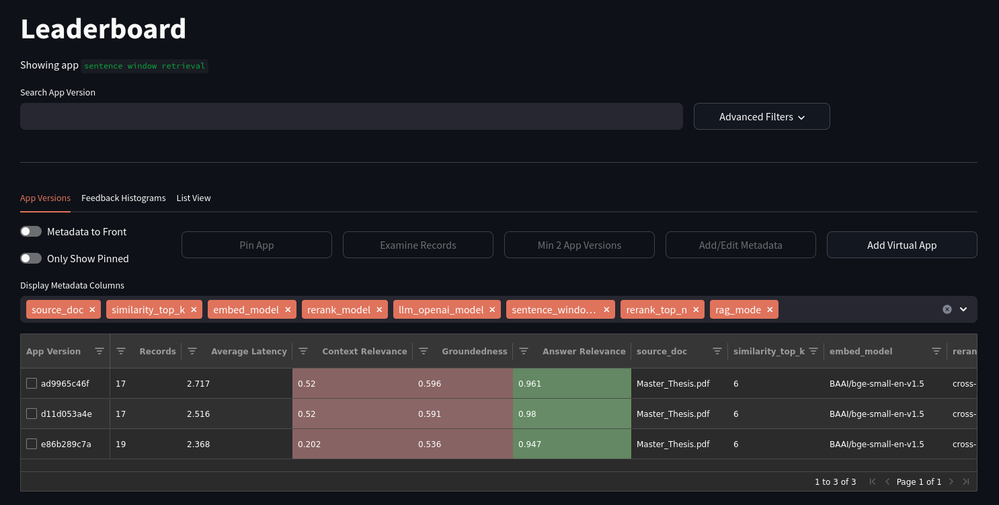

# mythesis-chatbot <!-- omit from toc -->
*A RAG chatbot trained on my master thesis. [Live demo](https://huggingface.co/spaces/leo-pasi/mythesis-chatbot) on Hugging Face Spaces.*

## Table of contents <!-- omit from toc -->

- [Overview](#overview)
  - [Retrieval-Augmented Generation](#retrieval-augmented-generation)
  - [Evaluation](#evaluation)
  - [Live Demo](#live-demo)
- [Installation](#installation)
  - [Install Poetry](#install-poetry)
  - [Install poetry plugins](#install-poetry-plugins)
  - [Create virtual environment](#create-virtual-environment)
  - [Configuring OpenAI API Key and Supabase connection strings](#configuring-openai-api-key-and-supabase-connection-strings)
  - [Running Scripts](#running-scripts)
  - [Verifying Setup](#verifying-setup)
  - [Install pre-commit hooks](#install-pre-commit-hooks)


## Overview

### Retrieval-Augmented Generation

Retrieval-Augmented Generation (RAG) enables large language models (LLMs) to dynamically retrieve and leverage information from external knowledge bases instead of relying solely on the data these models were trained on. RAG operates in two main phases:

- Retrieval: When a user submits a query, the system searches a pre-indexed external knowledge base (which could include documents, databases, websites, or internal company data) to find relevant information snippets related to the query.

- Generation: These retrieved snippets are then combined with the original query and fed into the LLM. The model uses this augmented input to generate a response that is grounded in the retrieved factual data, thereby enhancing accuracy and specificity.

For this project, I chose my master thesis (`data/Master_Thesis.pdf`) as the external knowledge base. I used [llama-index](https://docs.llamaindex.ai/en/stable/) to experiment with three retrieval techniques:

- **Classic retrieval**: top-k most relevant text chunks are returned following vector similarity search. A reranker model is used to retain only the most relevant information.

- **Sentence window retrieval**: the top-k most relevant chuncks are expanded with a "window" of surrounding sentences. The reranker model is used on the whole windows.

- **Auto-merging retrieval**: this relies on hierarchical chunking: documents are first split into a hierarchy of nodes (chunks). The embeddings of the leaf nodes constitute the vector store. As before, when a user submits a query, the system retrieves the most relevant (leaf) nodes using vector similarity search. If several retrieved leaf nodes belong to the same parent node and exceed a predefined threshold, the system automatically merges these child nodes and retrieves the full parent node instead. These merged nodes are also fed to the reranker model.

The retrieval step of the pipeline is executed locally, with open weights models:
- The embedding model: [BAAI/bge-small-en-v1.5](https://huggingface.co/BAAI/bge-small-en-v1.5)
- The reranker model: [cross-encoder/ms-marco-MiniLM-L-2-v2](https://huggingface.co/cross-encoder/ms-marco-MiniLM-L2-v2)

For the generation step I rely on API calls to [OpenAI](https://platform.openai.com/docs/overview). I've experimented with `gpt-4o-mini` and `gpt-3.5-turbo`.

### Evaluation

I've implemented a LLM-based (`gpt-4o-mini`) automatic evaluation of the RAG pipelines with [TruLens](https://www.trulens.org/). Three feedback functions are computed:
- **context relevance**: is the retrieved context relevant to the query?
- **groundedness**: is the response supported by the context?
- **answer relevance**: is the response relevant to the query?


A set of evaluation questions is defined at `/data/eval_questions.txt`. Evaluations of a RAG pipeline are run with the cell-based script at `/scripts/run_evaluation.py`. The results can be explored with TruLens built-in Streamlit dashboard (see screenshot below), providing rich insight. Each RAG pipeline is uniquely identified with the hash of its configuration file, which enables easy tracking of experiments. All feedback evaluation are logged to a remote postgresql database, hosted by [supabase](https://supabase.com/). Of course, I could have kept this local, but I'm simulating a team work setting.

<p align="center">

</p>

### Live Demo

After tweaking the parameters to optimize performance, the three RAG systems have been
deployed to Hugging Face Spaces ([here](https://huggingface.co/spaces/leo-pasi/mythesis-chatbot)). The Gradio app is defined at `scripts/app.py`. It can also be run locally. The code deployed to Spaces is the `deploy` branch, which is a trimmed-down version of the `main` branch, keeping all the essential to run the app. All user
queries and system responses, as well as automatic evaluation of these responses, are saved to a remote postgresql database hosted by supabase. This is a production database that is separate from the database used for development, and is meant to be used to monitor the performance of the deployed systems.

## Installation

This project uses **Poetry** for dependency management and environment setup.
Follow the instructions below to set up the environment and run the project.

### Install Poetry

If you don't have **Poetry** installed, a nice way to do so is using [pipx](https://github.com/pypa/pipx).

```
pipx install poetry
```

### Install poetry plugins

1. poetry-plugin-dotenv: the plugin that automatically loads environment variables from a `.env` file into the environment before poetry commands are run
```bash
poetry self add poetry-plugin-dotenv
```

2. poetry-plugin-shell (optional): the plugin to run subshell with poetry virtual environment activated
```bash
poetry self add poetry-plugin-shell
```

3. Verify:
```bash
poetry self show plugins
```

### Create virtual environment

Once you've cloned the repo, from the project's root directory, install dependencies using Poetry:
```bash
poetry install
```
This will create a virtual environment and install all dependencies listed in the `poetry.lock` file.

### Configuring OpenAI API Key and Supabase connection strings

1. Create a `.env` file in the root directory of the project:
```bash
touch .env
```

2. Add your OpenAI API key and Supabase connection strings to the `.env` file:
```
OPENAI_API_KEY=your_api_key_here
SUPABASE_DEV_CONNECTION_STRING_IPV4=
SUPABASE_PROD_CONNECTION_STRING_IPV4=
```

**Note**: Make sure to keep your `.env` file private and not to commit it to version control.
It's included in `.gitignore` to prevent accidental commits.

### Running Scripts

To run scripts using Poetry:

```bash
poetry run python -m scripts.app
```

Optionally, create a subshell with Poetry’s virtual environment activated:
```bash
poetry shell
```
Then:
```bash
python -m scripts.app
```

### Verifying Setup

To verify that everything is set up correctly:

```bash
poetry run python -c "import os; print(os.getenv('OPENAI_API_KEY'))"
```

This should load your API key from the `.env` file and print it.

### Install pre-commit hooks
I use `black`, `isort` and `flake8` for formatting, import sorting, and linting. These
are run automatically at every commit through the installation of pre-commit hooks.
```bash
poetry run pre-commit install
```
